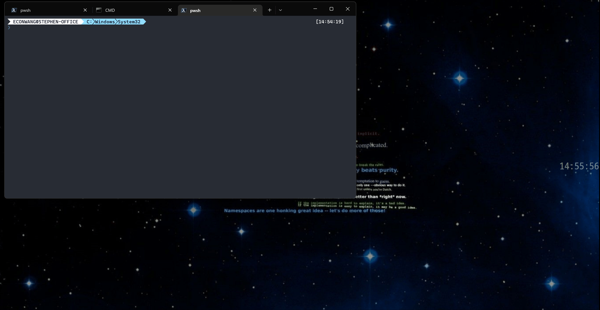

# Windows Desktop Clock



## Install

1. Download the lasted released package.

2. Unzip to local folder then double-click the `desktop-clock.exe`.

3. Auto Run when Windows restart: create a shortcut of `desktop-clock.exe`, then move it to `C:\Users\xxx\AppData\Roaming\Microsoft\Windows\Start Menu\Programs\Startup`

## Customize

You can find the setting file in `./settings/settings.ini`， where you can change the color, font, and location.

## Compile

```cmd
git clone https://github.com/econwang/windows-desktop-clock.git
cd windows-desktop-clock
set /P B_Version=< version
python -m nuitka --standalone --lto=yes ^
    --windows-disable-console --static-libpython=no --plugin-enable=tk-inter ^ 
    --windows-icon-from-ico=logo.ico --windows-product-name=Destop-Clock ^
    --windows-company-name=ECONWANG --windows-product-version=%B_Version%.0 ^
    --windows-file-description=Desktop-Clock --include-data-dir=settings=settings ^
    --output-dir=build desktop-clock.py
```
